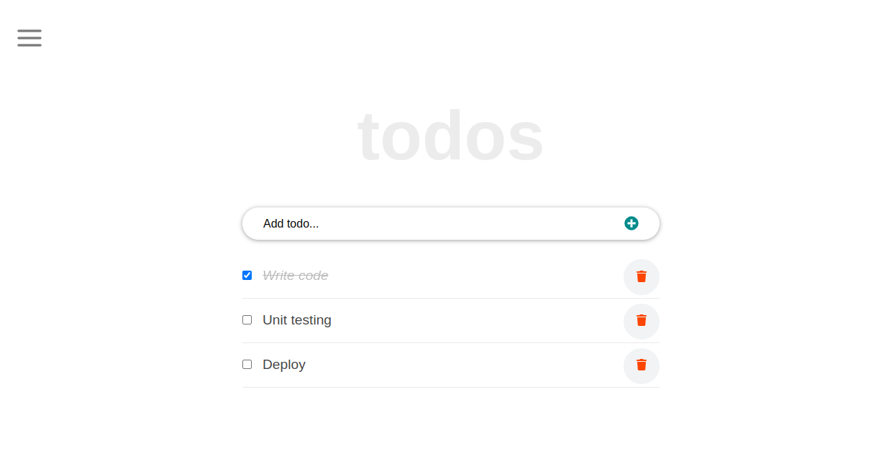
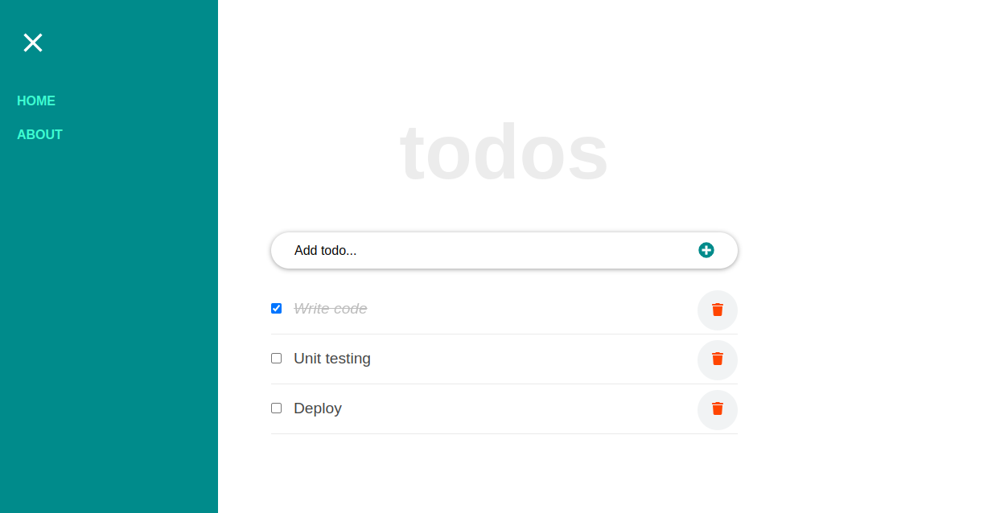

# Todo List 

> Todo List is an app build to keep track of your daily activities using ReactJS

## Built With

- React 
- Class Component
- Convert Class componets to function components

## Live Demo

[Live Demo Link](https://emmy-github-webdev.github.io/react-to-do/)

## Getting Started

To get a local copy up and running follow these simple steps.

### Prerequisites
- A working Laptop or Desktop
- Internet
- Knowledge of React, RReact component

### Setup
- Install code editor
- Install Git bash
- Install react app
### Install

- React:
npx create-react-app the-app-name

### Clone Project
[Todo List](https://github.com/Emmy-github-webdev/react-to-do)

### Usage

The Todo List is an activity tracker

### Run tests
- npm run start

### Deployment
- [GitHub Page](https://docs.github.com/en/pages/getting-started-with-github-pages/creating-a-github-pages-site)

## Authors

👤 **Emmanuel Ogah**

- GitHub: [@githubhandle](https://github.com/githubhandle)
- Twitter: [@twitterhandle](https://twitter.com/twitterhandle)
- LinkedIn: [LinkedIn](https://linkedin.com/in/linkedinhandle)

## 🤝 Contributing

Contributions, issues, and feature requests are welcome!

Feel free to check the [issues page](https://github.com/Emmy-github-webdev/react-to-do/issues).

## Show your support

Give a ⭐️ if you like this project!

## Acknowledgments

- Inspiration

## 📝 License

This project is [MIT](./MIT.md) licensed.
